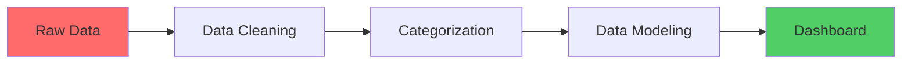

<div align="center">

# 💰 Loan & Financial Risk Analysis Dashboard

### Comprehensive Power BI Solution for Credit Risk Assessment & Portfolio Management


<br>

[📊 View Dashboard](#-dashboard-pages) • [💡 Key Insights](#-insights-uncovered) • [🚀 Get Started](#-how-to-use)

</div>

---

## 📌 Executive Summary

A **Financial Analytics Dashboard** designed for loan service providers to analyze customer demographics, monitor loan performance, and assess financial risk through interactive visualizations.

<div align="center">

| Metric | Description |
|:------:|:------------|
| 🎯 **3 Dashboard Pages** | Customer Demographics, Loan Portfolio, Risk Analysis |
| 📊 **10+ Key Measures** | Comprehensive loan and risk metrics |
| 🔍 **4 Risk Categories** | High, Moderate, Low, Very Low risk segmentation |
| 📈 **Interactive Slicers** | Filter by Income, Credit Score, Employment |

</div>

---

## ✨ Key Capabilities

```
┌─────────────────────────────────────────────────────────────────────────────┐
│                                                                             │
│  📊 CUSTOMER PROFILING      │  💳 LOAN MONITORING      │  ⚠️ RISK ANALYSIS  │
│  ─────────────────────      │  ─────────────────       │  ────────────────  │
│  • Demographics analysis    │  • Portfolio tracking    │  • Default prediction │
│  • Income segmentation      │  • Status monitoring     │  • Risk categorization │
│  • Credit score buckets     │  • EMI trends           │  • Segment targeting   │
│                                                                             │
└─────────────────────────────────────────────────────────────────────────────┘
```

---

## 📁 Dataset Schema

### 👤 Customer Details
| Column | Type | Description |
|--------|:----:|-------------|
| `Customer ID` | 🔑 | Unique customer identifier |
| `Name` | 📝 | Customer name |
| `Age` | 🔢 | Age in years |
| `Gender` | 👥 | Male / Female / Other |
| `Income` | 💵 | Annual income |
| `Employment Status` | 💼 | Full-time, Part-time, Self-employed |
| `Education Level` | 🎓 | Highest qualification |
| `Credit Score` | 📊 | Credit rating (300-850) |

### 💳 Loan Details
| Column | Type | Description |
|--------|:----:|-------------|
| `Loan ID` | 🔑 | Unique loan identifier |
| `Customer ID` | 🔗 | Foreign key to Customer |
| `Loan Amount` | 💰 | Amount issued |
| `Interest Rate` | 📈 | Rate of interest (%) |
| `Term` | ⏱️ | Loan duration (months) |
| `Issue Date` | 📅 | Date of loan issuance |
| `Status` | 🚦 | Active / Defaulted / Closed |
| `Monthly Installment` | 💵 | EMI amount |

---

## ⚙️ Data Processing Pipeline



### 🧹 Data Cleaning
- ✅ Removed duplicates and null values
- ✅ Standardized data types and formats
- ✅ Validated referential integrity

### 🏷️ Data Categorization

| Category | Buckets | Logic |
|----------|---------|-------|
| **Age Group** | Young, Middle-aged, Senior, Elder | Age-based segmentation |
| **Credit Score** | Poor → Excellent | 5-tier rating system |
| **Income Group** | Low, Medium, High | Income percentiles |
| **Risk Category** | Based on Credit Score | See below 👇 |

#### 🎯 Risk Classification Logic
```
Credit Score < 580   → 🔴 High Risk
Credit Score < 670   → 🟠 Moderate Risk  
Credit Score < 740   → 🟡 Low Risk
Credit Score ≥ 740   → 🟢 Very Low Risk
```

### 🔗 Data Modeling
- **Relationships**: One-to-Many (Customer → Loans, Loan → Date)
- **Date Table**: `CALENDARAUTO()` DAX function
- **Star Schema**: Fact table with dimension lookups

---

## 📊 Key Measures (DAX)

<table>
<tr>
<td width="50%">

**📈 Loan Metrics**
- Total Loan Amount
- Average Interest Rate
- Average Monthly Installment (EMI)

</td>
<td width="50%">

**👥 Customer Metrics**
- Total Customers
- Average Age
- Average Income

</td>
</tr>
<tr>
<td>

**⚠️ Risk Metrics**
- Defaulted Loans Count
- Default Loan Amount

</td>
<td>

**🔴 High Risk Metrics**
- High Risk Loans Count
- High Risk Loan Amount

</td>
</tr>
</table>

---

## 🧠 Dashboard Pages

### 📌 Page 1: Customer Demographics
> *Understanding borrower profiles and credit distribution*

| Component | Type | Purpose |
|-----------|------|---------|
| **KPI Cards** | Metric | Total Customers, Avg Age, Avg Income |
| **Slicers** | Filter | Income Group, Credit Score Bucket |
| **Gender Distribution** | Pie Chart | Male/Female/Other breakdown |
| **Education Breakdown** | Pie Chart | Qualification distribution |
| **Credit Score Analysis** | Clustered Bar | Score by Gender & Education |

---

### 📌 Page 2: Loan Portfolio & Performance
> *Monitoring loan issuance and status tracking*

| Component | Type | Purpose |
|-----------|------|---------|
| **KPI Cards** | Metric | Total Loan Amount, Avg Interest, Avg EMI |
| **Slicers** | Filter | Credit Score, Income Group |
| **Loan Type Mix** | Pie Chart | Personal, Home, Auto, Student |
| **Status by Type** | Stacked Column | Active/Defaulted/Closed per type |
| **Top 10 Tables** | Data Tables | Largest Active & Defaulted loans |

---

### 📌 Page 3: Financial Risk Analysis
> *Identifying high-risk segments and default patterns*

| Component | Type | Purpose |
|-----------|------|---------|
| **KPI Cards** | Metric | Defaults, Default Amount, High Risk stats |
| **Risk by Employment** | Donut Charts | Default & High Risk by job type |
| **Cross Analysis** | Matrix | Income vs Education Level |
| **Employment Trends** | Column Chart | Credit Score by Employment |

---

## 🏆 Insights Uncovered

<div align="center">

| # | Finding | Impact |
|:-:|---------|--------|
| 1️⃣ | Most defaults in **low-income + poor credit** groups | Target for risk mitigation |
| 2️⃣ | High-risk loans prevalent in **part-time & self-employed** | Adjust approval criteria |
| 3️⃣ | **Graduate/Postgraduate** customers have higher credit scores | Lower risk segment |
| 4️⃣ | **Student & Personal loans** show higher default rates | Review interest rates |
| 5️⃣ | EMI trends vary by income and education level | Customize loan terms |

</div>

---

## 🚀 Business Value

```
┌────────────────────────────────────────────────────────────────────┐
│                                                                    │
│   📊 PORTFOLIO HEALTH        Track loan status in real-time       │
│   🎯 RISK TARGETING          Identify high-risk customer segments │
│   💰 POLICY OPTIMIZATION     Set data-driven interest & terms     │
│   🔍 CREDIT SEGMENTATION     Filter and analyze borrower groups   │
│                                                                    │
└────────────────────────────────────────────────────────────────────┘
```

---

## 💻 How to Use

### Prerequisites
- [Power BI Desktop](https://powerbi.microsoft.com/en-us/downloads/) (Free)

### Quick Start
```bash
# 1. Clone this repository
git clone https://github.com/rahulx2001/Financial-Risk-Analysis-Dashboard.git

# 2. Open the Power BI file
# Navigate to the folder and open:
# "Loan & Financial Risk Analysis Dashboard.pbix"

# 3. Explore the dashboard!
# Use slicers to filter data by various segments
```

---

## 📂 Project Structure

```
Financial-Risk-Analysis-Dashboard/
├── 📊 Loan & Financial Risk Analysis Dashboard.pbix    # Main dashboard file
└── 📖 README.md                                         # Documentation
```

---

## 🛠️ Technical Stack

<div align="center">

| Tool | Purpose |
|:----:|---------|
|  | Dashboard Development |
|  | Calculated Measures |
|  | Data Transformation |

</div>

---

## 🤝 Connect With Me

<div align="center">

[](https://linkedin.com/in/rahulx2001)
[](https://github.com/rahulx2001)
[](https://rahulkumarsingh-portfolio.vercel.app)

</div>

---

<div align="center">

**⭐ If you found this project useful, please consider giving it a star!**

*Built with 💜 by [Rahul Kumar Singh](https://github.com/rahulx2001)*

</div>
